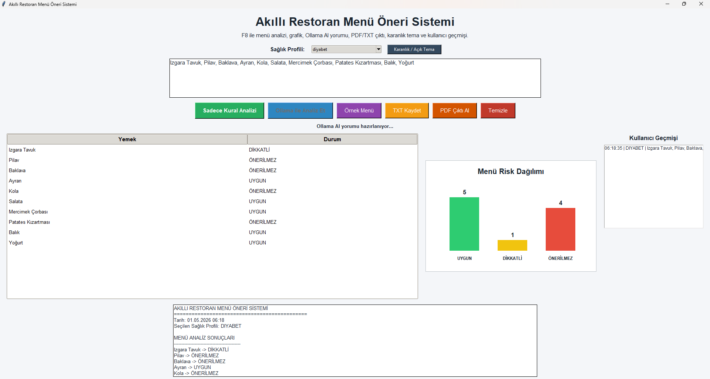

<p align="center">
  
</p>

<h1 align="center">🍽️ Akıllı Restoran Menü Öneri Sistemi</h1>

<p align="center">
  Yapay Zekâ Destekli • Veri Analizi • Sağlık Odaklı Karar Sistemi
</p>

<p align="center">
  
  
  
  
</p>

---

## 📌 Proje Tanımı

Akıllı Restoran Menü Öneri Sistemi, restoran menülerini kullanıcıların sağlık profiline göre analiz eden, grafiksel çıktı üreten ve yerel yapay zekâ (Ollama) ile desteklenen gelişmiş bir masaüstü uygulamasıdır.

Bu proje; **kural tabanlı analiz + yapay zekâ yorumlama + kullanıcı etkileşimi** katmanlarını bir araya getirerek klasik ders projelerinin ötesine geçen hibrit bir sistem sunar.

---

## 🎯 Projenin Amacı

- Kullanıcıların restoranlarda daha bilinçli seçim yapmasını sağlamak  
- Sağlık durumuna göre uygun yemekleri belirlemek  
- Veri analizi ve yapay zekâyı tek bir uygulamada birleştirmek  
- Gerçek zamanlı, kullanıcı dostu bir analiz aracı sunmak  

---

## 💡 Neden Bu Proje?

Çoğu menü sistemi kullanıcıların sağlık durumunu dikkate almaz.

Bu proje:

- Sağlık odaklı karar verme sağlar  
- Ham menü verisini anlamlı bilgiye dönüştürür  
- Yapay zekâ ile desteklenmiş öneriler sunar  

---

## 🧠 Sistem Mimarisi

### 1️⃣ Veri Girişi Katmanı
- Menü manuel girilir veya dışarıdan kopyalanır  
- **F8 tuşu ile otomatik veri yakalama (event-driven sistem)**  

---

### 2️⃣ Kural Tabanlı Analiz

Menüdeki yemekler sağlık profiline göre analiz edilir:

| Profil | Riskli Yiyecekler |
|------|----------------|
| Diyabet | Şekerli, karbonhidratlı |
| Tansiyon | Tuzlu, işlenmiş |
| Diyet | Yüksek kalorili |

Sonuç sınıfları:

- 🟢 UYGUN  
- 🟡 DİKKATLİ  
- 🔴 ÖNERİLMEZ  

---

### 3️⃣ Yapay Zekâ Katmanı (Ollama)

- Model: `llama3.2:1b`  
- API: `http://localhost:11434`  

AI şu işlemleri yapar:

- Menü yorumlama  
- Sağlık bazlı öneri üretme  
- Açıklamalı analiz sunma  

---

### 4️⃣ Görselleştirme Katmanı

- Grafik (bar chart)
- Renkli analiz
- Hızlı karar desteği

---

## 🚀 Özellikler

### 🔥 Temel Özellikler
- Sağlık profili seçimi  
- Menü analizi  
- Grafiksel veri görselleştirme  
- F8 ile hızlı analiz  
- Tablo halinde sonuç gösterimi  

---

### 🤖 Yapay Zekâ Özellikleri
- Ollama entegrasyonu  
- Yerel AI modeli (internet gerektirmez)  
- Açıklamalı yorum üretimi  

---

### 💾 Veri Yönetimi
- TXT olarak analiz kaydetme  
- PDF çıktı alma  
- Kullanıcı geçmişi  
- Geçmiş analizleri tekrar yükleme  

---

### 🎨 Kullanıcı Deneyimi
- Karanlık / açık tema  
- Modern arayüz  
- Kullanıcı dostu tasarım  

---

## 📊 Sistem Akışı
Menü → Analiz → Grafik → AI → Sonuç

---

## 📸 Demo

<p align="center">
  
</p>

---

## ⚙️ Kurulum

### 1. Python Kütüphaneleri

```bash
python -m pip install requests

ollama pull llama3.2:1b

python main.pyw

⚡ Kullanım
1. Uygulamayı başlat
2. Sağlık profilini seç
3. Menü gir veya kopyala
4. F8 tuşuna bas veya analiz butonuna tıkla
5. Sonuçları grafik, tablo ve AI yorumu olarak görüntüle

📌 Örnek Menü
Izgara Tavuk, Pilav, Baklava, Ayran, Kola, Salata

📌 Örnek Çıktı
Izgara Tavuk → UYGUN
Pilav → ÖNERİLMEZ
Baklava → ÖNERİLMEZ
Ayran → UYGUN
Kola → ÖNERİLMEZ
Salata → UYGUN

🧾 Çıktı Özellikleri
TXT dosyası olarak kaydetme
PDF rapor oluşturma
Analiz sonuçlarını dışa aktarma

🧠 Kullanıcı Geçmişi
Yapılan analizler saklanır
Listede gösterilir
Tek tıkla tekrar yüklenebilir

🎨 Tema Sistemi
Açık tema
Karanlık tema

🏆 Proje Türü
Akademik Proje ✔
Gerçek Dünya Uygulaması ✔
AI Entegre Sistem ✔
Veri Görselleştirme Aracı ✔

⚡ Yenilikçi Yön

Bu proje, kural tabanlı sistem + yerel yapay zekâ (Ollama) birleşimini tek uygulamada sunar.

Bu sayede:

Hibrit analiz yapılır
Gerçek zamanlı etkileşim sağlanır
AI destekli açıklamalar üretilir

📈 Proje Katkısı

Bu proje aşağıdaki alanları bir araya getirir:

Veri analizi
GUI geliştirme
Event-driven programlama
Yapay zekâ entegrasyonu
Veri görselleştirme

⚠️ Not

Bu proje eğitim amaçlıdır.
Tıbbi tavsiye yerine geçmez.
👨‍💻 Geliştirici

Bu proje, veri görselleştirme ve yapay zekâ entegrasyonu alanlarında ileri seviye bir uygulama olarak geliştirilmiştir.
